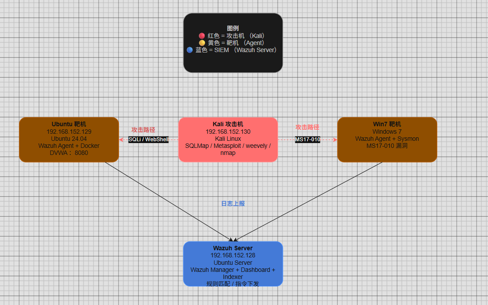

# Purple Team Lab — 企业级全栈攻防模拟实验室

<p align="center">
  
</p>

<p align="center">
  
  
  
  
  
  
</p>

---

## 项目概述

基于 **Wazuh SIEM** 搭建的企业级安全监控架构，在虚拟化环境中模拟真实内网攻防场景。从 **攻击者（Kali）** 视角实施渗透测试，再切换至 **蓝队视角** 通过 Sysmon 日志溯源攻击链路、编写自定义检测规则、开发自动化响应脚本，形成完整的 **紫队（Purple Team）** 攻防闭环。

## 核心目标

| 目标 | 说明 |
|------|------|
| 攻防闭环 | 攻击→日志采集→规则检测→告警→自动阻断，全流程可复现 |
| 规则调优 | 基于 ATT&CK 框架编写自定义 Wazuh 规则，降低误报/漏报 |
| 自动化响应 | 将 MTTR（平均响应时间）压缩至 2 秒以内 |

## 环境架构

| 角色 | 主机名 | IP 地址 | 操作系统 | 用途 |
|------|--------|---------|----------|------|
| SIEM 服务器 | Wazuh-Server | `192.168.152.128` | Ubuntu Server | Wazuh Manager + 规则匹配 + 指令下发 |
| 目标靶机 | Ubuntu-Target | `192.168.152.129` | Ubuntu 24.04 | Wazuh Agent + Docker 靶场 |
| 攻击机 | Kali-Linux | `192.168.152.130` | Kali Linux | SQL 注入、端口扫描等攻击 |
| 内网终端 | Win7-Target | DHCP | Windows 7 | 内网客户端 + Sysmon + Wazuh Agent |
| 业务应用 | DVWA | Docker :8080 | Docker Container | 在 Ubuntu 靶机 8080 端口运行 |

> 注：实际部署中 IP 请按自身网络环境调整。

## 攻防演练链路

```
Kali-Linux 
  │
  ├── SQLi ──────► Ubuntu-Target:8080/DVWA
  │                   └──► Wazuh Agent ──► Wazuh Server (规则匹配) ──► 告警
  │
  ├── WebShell ──► Ubuntu-Target:8080/DVWA
  │                   └──► Wazuh Agent ──► Wazuh Server ──► 规则匹配
  │
  └── MS17-010 ──► Win7-Target
                      └──► Sysmon ──► Wazuh Agent ──► Wazuh Server ──► 自动封禁
```

## 核心成果

| 成果 | 详情 |
|------|------|
| 自定义检测规则 | 15+ 条 Wazuh 规则（SQLi、暴力破解、WebShell、MS17-010、异常进程） |
| 自动化响应 | Python API 自动封禁插件，iptables 阻断 < 2s |
| 日志采集 | Sysmon 内核级日志 + Wazuh FIM（文件完整性监控） |
| 渗透报告 | 覆盖"攻击留痕→日志分析→加固建议"完整闭环 |
| 代码开源 | 规则、脚本、配置全量开源 |

## 文档导航

| 文档 | 内容 |
|------|------|
| [01-环境架构与拓扑](docs/01-环境架构与拓扑.md) | 网络拓扑设计、各组件角色与交互 |
| [02-环境搭建步骤](docs/02-环境搭建步骤.md) | 从零搭建 Wazuh + Sysmon + 靶机环境 |
| [03-渗透攻击测试](docs/03-渗透攻击测试.md) | SQLi、WebShell、MS17-010 实战操作 |
| [04-检测规则编写](docs/04-检测规则编写.md) | 自定义 Wazuh 规则的设计、编写与调试 |
| [05-自动化响应开发](docs/05-自动化响应开发.md) | Python API 自动封禁插件的完整开发过程 |
| [06-问题排查与调试](docs/06-问题排查与调试.md) | 踩坑记录与解决方案 |

## 项目结构

```
Purple-Team-Lab/
├── README.md
├── docs/
│   ├── 01-环境架构与拓扑.md
│   ├── 02-环境搭建步骤.md
│   ├── 03-渗透攻击测试.md
│   ├── 04-检测规则编写.md
│   ├── 05-自动化响应开发.md
│   ├── 06-问题排查与调试.md
│   └── screenshots/
│       ├── 环境拓扑图.png
│       ├── wazuh界面.png
│       ├── sql攻击.png
│       ├── sql注入测试.png
│       ├── sqlmap攻击.png
│       ├── webshell上传.png
│       └── 永恒之蓝复现.png
├── rules/
│   ├── custom-bruteforce.xml
│   ├── custom-sqli.xml
│   ├── custom-webshell.xml
│   ├── custom-ms17-010.xml
│   └── custom-malicious-process.xml
├── scripts/
│   ├── auto-block-ip.py
│   └── sysmon-config.xml
├── reports/
│   └── 渗透测试报告.md
└── assets/
    └── topology.drawio
```

## 快速开始

```bash
# 1. 克隆项目
git clone https://github.com/IKEA311/Wazuh-SOC-IPS-Lab.git
cd Wazuh-SOC-IPS-Lab

# 2. 部署 Wazuh Manager
# 参考 docs/02-环境搭建步骤.md

# 3. 在各靶机安装 Wazuh Agent
# 详见 docs/02-环境搭建步骤.md

# 4. 部署自定义规则
sudo cp rules/*.xml /var/ossec/etc/rules/
sudo systemctl restart wazuh-manager
```

## 技术栈

- **SIEM**: Wazuh 4.x (Manager + Indexer + Dashboard)
- **EDR**: Sysmon (Windows 内核级日志采集)
- **攻击**: Kali Linux (SQLMap, Metasploit, weevely)
- **开发**: Python 3 (Wazuh API SDK)
- **虚拟化**: VMware Workstation
- **容器**: Docker + Docker Compose

## 许可证

本项目仅供安全研究与教育用途。

---

<p align="center">
  <b>紫队思维 · 以攻促防</b>
</p>
